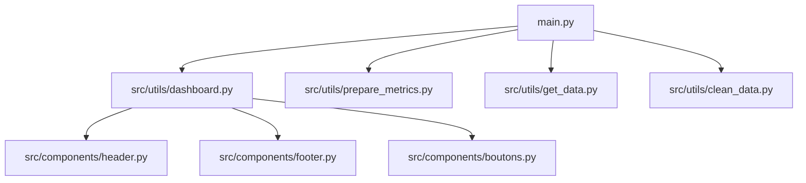


# Dashboard des Restaurants en France.

Ce dépôt contient un projet de Dashboard ayant pour but d'analyser et de visualiser des données sur les restaurants en France via des graphes.

---

## User Guide
Liste des commandes à exécuter dans l'ordre pour télécharger et faire fonctionner le Dashboard

### Déploiement
1. **Cloner le dépôt** :
   Commandes : 
   git clone https://github.com/LohanQ/Dashboard.git
   cd Dashboard

2. **Installer les dépendances** :
   Utilisez un environnement virtuel et installez les packages nécessaires :
   Commandes : 
   python -m venv venv
   source venv/bin/activate  # Sur Windows : venv\Scripts\activate
   pip install -r requirements.txt
   

3. **Lancer le tableau de bord** :
   Commandes : 
   python main.py

4. **Ouverture du Dashboard** :
   Si le Dashboard ne s'est pas ouvert tout seul, ouvrez votre navigateur à l'adresse : http://localhost:8050.

---

## Data

### Sources des données
- **Données brutes** : Fichier CSV contenant les informations sur les restaurants en France, disponible dans `data/raw/osm-france-food-service.csv`.
- **Données nettoyées** : Générées automatiquement et sauvegardées dans `data/cleaned/cleaneddata.csv` après exécution du code.

---

## Developer Guide

### Structure du projet
```plaintext
Dashboard/
│
├── main.py               # Lancement du Dashboard
├── config.py             # Fichier de configuration
├── data/                 # Contient les fichiers de données
│   ├── raw/              # Données brutes
│   ├── cleaned/          # Données nettoyées
│   └── departement.geojson  # Informations frontiere départements
├── src/
│   ├── components/       # Composants du dashboard
│   │   ├── boutons.py    # Boutons 
│   │   ├── footer.py     # Pied de page
│   │   ├── header.py     # En-tête
│   │   └── __init__.py
│   ├── utils/            # Fonctions utilitaires
│   │   ├── clean_data.py # Nettoyage des données
│   │   ├── get_data.py   # Lecture des données
│   │   ├── prepare_metrics.py # Création des métriques utilisées
│   │   ├── dashboard.py  # Construction Dashboard
│   │   └── __init__.py
│   └── __init__.py
├── README.md             # Documentation
└── requirements.txt             # Fichier d'installion
```

### Ajout d'une nouvelle page ou graphique
1. Créez un nouveau bouton dans `src/components/boutons.py`.
2. Ajoutez une nouvelle condition dans le if/elif de la fonction display_content dans `src/utils/dashboard.py`.
3. Créer le graphique voulu dans la condition et ajouter une nouvelle fonction update si besoin pour actualiser le graphique.

### Diagramme d'architecture


---

## Rapport d'analyse

### Résumé des conclusions
- **Types d'établissements** : Les restaurants représentent la moitié des établissements en France devant les fast_food et les bars.
- **Types d'établissements** : Les restaurants minoritaires en France sont les brasseries, les food-courts et les glaceries.
- **Répartition géographique par région** : Ile de France possède de loin la présente la plus forte concentration d'établissements gastronomiques.
- **Répartition géographique par département** : Paris regroupe le plus d'établissements gastronomiques suivis par les départements proche de la méditérranée.
- **Investissements** : Le marché des restaurants semble saturé et ouvrir ce genre de commerces peut être difficile.

---

## Copyright

Nous déclarons sur l’honneur que le code fourni a été produit par nous-même, à l’exception des lignes ci-dessous.

### Code emprunté
- L'utilisation de **Plotly Dash** pour construire le tableau de bord s'appuie sur la documentation officielle : https://dash.plotly.com/
- Nous nous sommes inspirées du site https://plotly.com/python/ pour faire nos graphes

### Déclaration d'intégrité
Toutes les lignes de code non mentionnées ci-dessus sont réputées être produites par nous-même. Toute omission ou fausse déclaration sera considérée comme du plagiat.

---

## Contributeurs
- DIBOUES Killian
- QUINTARD Lohan
